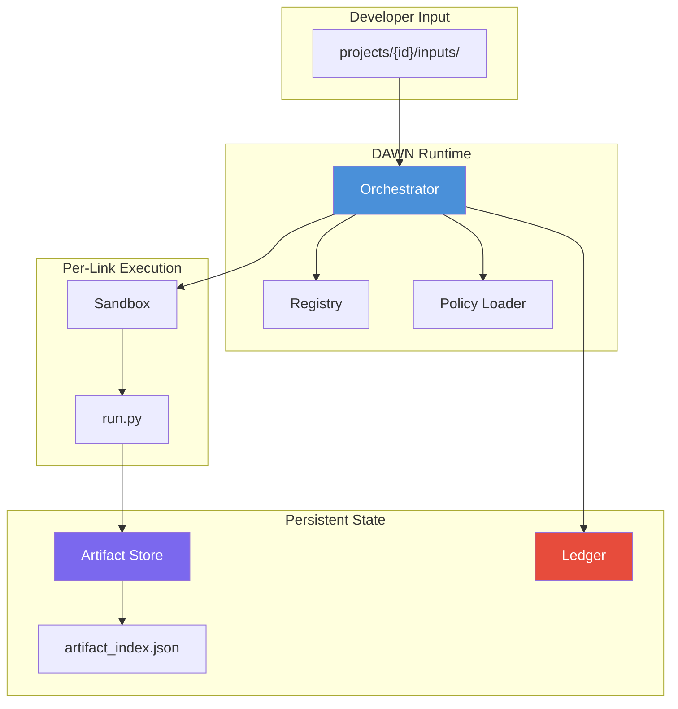

# DAWN Developer Guide

> **Audience:** Developers who want to understand, extend, or integrate with the DAWN framework.
> **Version:** 1.0 — Last updated 2026-02-14

---

## Table of Contents

1. [System Overview](#1-system-overview)
2. [Architecture](#2-architecture)
3. [Directory Layout](#3-directory-layout)
4. [Core Runtime Components](#4-core-runtime-components)
5. [Link System (The Unit of Work)](#5-link-system-the-unit-of-work)
6. [Pipeline System (Composing Links)](#6-pipeline-system-composing-links)
7. [Artifact System (Data Store)](#7-artifact-system-data-store)
8. [Ledger (Immutable Audit Log)](#8-ledger-immutable-audit-log)
9. [Policy & Security](#9-policy--security)
10. [Dataflow Walkthrough](#10-dataflow-walkthrough)
11. [Schema Reference](#11-schema-reference)
12. [Extending DAWN](#12-extending-dawn)

---

## 1. System Overview

DAWN (Deterministic Auditable Workflow Network) is a pipeline orchestration framework. It treats every software development step as a **Link** in a verifiable chain. Each Link declares what it needs and what it produces via strict contracts, and the runtime engine enforces these contracts cryptographically.

### Core Guarantees

| Guarantee | Mechanism |
|---|---|
| **Determinism** | Identical `inputs/` → identical `bundle_sha256`. No timestamps in artifacts. |
| **Auditability** | Every event is appended to an immutable JSONL ledger. |
| **Stale-Safety** | Human approvals are bound to a specific `bundle_sha256`. Changed files = revoked approval. |
| **Isolation** | Links write ONLY to their sandbox (`artifacts/<link_id>/`). Unauthorized writes are detected. |

---

## 2. Architecture



### Execution Flow (Simplified)

```
Developer places files in projects/{id}/inputs/
         │
         ▼
┌─────────────────────────────────────────────────────┐
│  Orchestrator.run_pipeline(project_id, pipeline.yaml)│
│                                                     │
│  1. Acquire project lock (filelock)                 │
│  2. Load pipeline YAML → ordered list of link IDs   │
│  3. Check project size budget                       │
│  4. For each link:                                  │
│     a. Calculate input_signature (SHA256)            │
│     b. Skip if signature matches last run            │
│     c. Validate required inputs exist                │
│     d. Execute run.py inside Sandbox                 │
│     e. Check for sandbox violations                  │
│     f. Validate produced outputs exist               │
│     g. Check output size budget                      │
│     h. Log event to Ledger                          │
│     i. Save artifact manifest                       │
│  5. Generate run_summary artifact                   │
│  6. Release project lock                            │
└─────────────────────────────────────────────────────┘
```

---

## 3. Directory Layout

```
DAWN/
├── dawn/                          # Framework source code
│   ├── runtime/                   # Core engine
│   │   ├── orchestrator.py        # Pipeline execution engine
│   │   ├── registry.py            # Link discovery (reads link.yaml)
│   │   ├── artifact_store.py      # Artifact registry & I/O
│   │   ├── sandbox.py             # Per-link isolated write scope
│   │   ├── ledger.py              # Append-only event log
│   │   └── policy_loader.py       # Runtime policy enforcement
│   │
│   ├── links/                     # Link implementations
│   │   ├── ingest.project_bundle/ # Each link is a folder
│   │   │   ├── link.yaml          # Contract declaration
│   │   │   └── run.py             # Execution logic
│   │   ├── hitl.gate/
│   │   ├── run.pytest/
│   │   ├── validation.self_heal/
│   │   └── ...                    # 58+ links available
│   │
│   ├── pipelines/                 # Pipeline definitions (YAML)
│   │   ├── autofix.yaml
│   │   ├── full_cycle.yaml
│   │   └── ...
│   │
│   ├── policy/
│   │   └── runtime_policy.yaml    # Budgets, security, profiles
│   │
│   └── schemas/                   # JSON schema definitions
│
├── projects/                      # Project workspaces
│   └── {project_id}/
│       ├── inputs/                # Developer-provided source files
│       ├── artifacts/             # Link-produced outputs (read-only)
│       │   ├── ingest.project_bundle/
│       │   │   ├── dawn.project.bundle.json
│       │   │   └── .dawn_artifacts.json   # Manifest
│       │   ├── hitl.gate/
│       │   │   └── approval.json
│       │   └── ...
│       ├── ledger/
│       │   └── events.jsonl       # Immutable audit trail
│       └── artifact_index.json    # Global artifact registry
│
├── forgechain_console/            # Web-based Operator Console (FastAPI)
└── scripts/                       # CLI tools & acceptance tests
```

---

## 4. Core Runtime Components

### 4.1 Orchestrator (`orchestrator.py`)

The central engine. Responsible for:

- **Project Locking:** Uses `filelock` to prevent concurrent runs on the same project.
- **Link Discovery:** Delegates to `Registry` to find link implementations.
- **Input Signature Calculation:** Generates a deterministic SHA256 from `link_id + config_hash + bundle_sha256`. If the signature matches the previous run, the link is **skipped** (idempotency).
- **Sandbox Enforcement:** Snapshots the filesystem before/after a link runs. Any writes outside `artifacts/` or `ledger/` trigger a `SANDBOX_VIOLATION`.
- **Budget Enforcement:** Enforces wall-clock timeouts, output size limits, and project size limits.
- **Run Summary Generation:** Produces a `dawn.metrics.run_summary` artifact at the end of each pipeline run.

**Key Method Signatures:**

```python
class Orchestrator:
    def __init__(self, links_dir, projects_dir, profile=None)
    def run_pipeline(self, project_id, pipeline_path, profile=None)

    # Internal methods:
    def _execute_link(self, context, link_id, link_path, link_config)
    def _calculate_input_signature(self, context, link_id, link_config)
    def _validate_inputs(self, context, link_id, link_config, ...)
    def _validate_outputs(self, context, link_id, link_config, ...)
    def _check_sandbox_violations(self, context, link_id, ...)
    def _execute_with_timeout(self, module, context, link_config, timeout_sec, ...)
```

### 4.2 Registry (`registry.py`)

Discovers all available links by scanning `dawn/links/` directories for folders containing a `link.yaml` file.

```python
class Registry:
    def discover_links(self)           # Scan directories for link.yaml files
    def get_link(self, link_id) -> dict # Returns {"path": ..., "metadata": ...}
    def list_links(self) -> list       # All registered link IDs
```

### 4.3 Artifact Store (`artifact_store.py`)

Manages the runtime artifact registry and file I/O.

```python
class ArtifactStore:
    def register(self, artifact_id, abs_path, schema=None, producer_link_id=None)
    def get(self, artifact_id) -> dict            # {path, schema, digest, ...}
    def write_artifact(self, link_id, filename, content) -> Path
    def read_artifact(self, link_id, filename) -> Any
    def save_manifest(self, link_id)              # Writes .dawn_artifacts.json
    def rehydrate_from_link_dir(self, link_id)    # Restores registry from manifest
    def get_digest(self, file_path) -> str         # SHA256 of file content
```

**Dual Registry Model:**
- `_registry` → Normal artifacts (visible to all downstream links).
- `_shadow_registry` → Shadow artifacts (experimental/draft, invisible by default).

### 4.4 Sandbox (`sandbox.py`)

Each link gets a `Sandbox` instance scoped to `artifacts/<link_id>/`. Links use it to write files and publish artifacts.

```python
class Sandbox:
    def write_json(self, path, obj) -> str      # Write JSON to sandbox
    def write_text(self, path, content) -> str   # Write text to sandbox
    def copy_in(self, src, dest) -> str          # Copy external file in
    def publish(self, artifact, filename, obj)   # Write + register artifact
    def publish_text(self, artifact, filename, text)
```

### 4.5 Ledger (`ledger.py`)

Append-only event log. Every link execution event is recorded as a single JSON line.

```python
class Ledger:
    def log_event(self, project_id, pipeline_id, link_id, run_id,
                  step_id, status, inputs=None, outputs=None,
                  metrics=None, errors=None, policy_versions=None,
                  drift_score=None, drift_metadata=None)

    def get_events(self, link_id=None) -> list   # Read/filter events
```

---

## 5. Link System (The Unit of Work)

A **Link** is the atomic building block of DAWN. Each link is a folder with two files:

```
dawn/links/<link_id>/
├── link.yaml    # Contract: what I need, what I produce
└── run.py       # Logic: how I do it
```

### 5.1 `link.yaml` Schema

```yaml
apiVersion: dawn.links/v1
kind: Link
metadata:
  name: <link_id>                  # Unique identifier (e.g., "ingest.project_bundle")
  description: "Human-readable purpose"
spec:
  requires:                        # Input contract
    - artifact: <artifact_id>      # Required artifact from upstream
      optional: true/false         # If false, link fails without it
  produces:                        # Output contract
    - artifact: <artifact_id>      # Artifact this link will create
      schema: json|text            # Schema type hint
      path: <filename>             # Physical filename
  config:                          # Link-specific configuration
    key: value
  runtime:
    timeoutSeconds: 300            # Wall-clock budget (0 = no timeout)
    retries: 0                     # Retry count on failure
    alwaysRun: true/false          # If true, skip logic is disabled
```

### 5.2 `run.py` Contract

Every `run.py` must expose a single function:

```python
def run(context: dict, link_config: dict) -> dict:
    """
    Args:
        context: Runtime context injected by Orchestrator
            - project_id: str
            - pipeline_id: str
            - project_root: str
            - artifact_store: ArtifactStore instance
            - ledger: Ledger instance
            - sandbox: Sandbox instance (write scope)
            - artifact_index: dict
            - status_index: dict (link_id -> status)
            - profile: str ("normal" | "isolation")

        link_config: Parsed link.yaml + pipeline overrides

    Returns:
        {
            "status": "SUCCEEDED" | "FAILED" | "BLOCKED",
            "outputs": {...},    # optional metadata
            "metrics": {...},    # optional performance data
            "errors": {...}      # optional error details
        }
    """
```

### 5.3 Key Links Catalog

| Link ID | Phase | Requires | Produces | Purpose |
|---|---|---|---|---|
| `ingest.project_bundle` | Ingestion | `inputs/` (by convention) | `dawn.project.bundle` | Creates deterministic manifest of all input files with SHA256 hashes |
| `ingest.handoff` | Ingestion | `dawn.project.bundle` | `dawn.project.ir` | Translates raw files into domain-agnostic Intermediate Representation |
| `hitl.gate` | Approval | `dawn.project.ir` (opt) | `dawn.hitl.approval` | Human-in-the-loop gate bound to `bundle_sha256` |
| `run.pytest` | Testing | `dawn.project.bundle` | `dawn.test.execution_report` | Executes pytest, captures results as JSON |
| `run.pytest_nonfatal` | Testing | `dawn.project.bundle` | `dawn.test.execution_report` | Same as above but returns SUCCEEDED even on test failure |
| `validation.self_heal` | Healing | `dawn.project.bundle` + `dawn.test.execution_report` | `dawn.healing.report` + `dawn.healing.metrics` | Autonomous bug-fixing loop (up to 5 cycles) |
| `scaffold.project` | Generation | `dawn.project.bundle` | Project files in `src/` | Generates initial project structure |
| `judge.model` | Evaluation | `dawn.project.bundle` + `dawn.test.execution_report` | `dawn.judge.score` | LLM-based quality scoring |
| `package.project_bundle` | Packaging | `dawn.project.bundle` | `dawn.release.bundle` | Creates release-ready archive |
| `package.evidence_pack` | Audit | All prior artifacts | `dawn.evidence.pack` | Bundles all artifacts for compliance |

---

## 6. Pipeline System (Composing Links)

A pipeline is a YAML file that defines an ordered sequence of links.

### 6.1 Pipeline YAML Schema

```yaml
pipelineId: <unique_name>
description: "What this pipeline does"
profile: normal|isolation        # Security profile (optional)

links:
  - id: ingest.project_bundle
  - id: hitl.gate
    config:                      # Override link-level config
      mode: AUTO
      auto_threshold: 0.8
  - id: run.pytest

overrides:                       # Conditional execution
  hitl.gate:
    spec:
      when:
        condition: on_success(ingest.project_bundle)
```

### 6.2 Built-in Pipelines

| Pipeline | Links | Use Case |
|---|---|---|
| `autofix.yaml` | ingest → validate → bundle → pytest_nonfatal → self_heal → package | Submit code, auto-fix bugs, package result |
| `full_cycle.yaml` | gate → ingest → validate → package → scaffold → spec | End-to-end with human approval |
| `verification.yaml` | ingest → pytest | Quick test-only pass |
| `verification_with_healing.yaml` | ingest → pytest_nonfatal → self_heal | Test + auto-heal |
| `test_stub.yaml` | ingest → handoff → hitl.gate → test.dummy | Acceptance test harness |

### 6.3 Conditional Execution

Links can be conditionally executed using `when` conditions:

```yaml
overrides:
  scaffold.project:
    spec:
      when:
        condition: on_success(package.project_bundle)
```

Supported conditions: `always`, `on_success(<link_id>)`, `on_failure(<link_id>)`.

---

## 7. Artifact System (Data Store)

### 7.1 Artifact Lifecycle

```
Link produces artifact
       │
       ▼
  Sandbox.publish()
       │
       ├── 1. Write JSON/text to artifacts/<link_id>/<filename>
       ├── 2. Register in ArtifactStore._registry
       │       { artifact_id → {path, schema, digest, producer_link_id} }
       └── 3. Save manifest to artifacts/<link_id>/.dawn_artifacts.json
              (enables rehydration on next run)
```

### 7.2 `artifact_index.json` Schema

The global registry at the project root. Maps logical artifact IDs to physical paths.

```json
{
  "dawn.project.bundle": {
    "path": "/absolute/path/to/artifacts/ingest.project_bundle/dawn.project.bundle.json",
    "schema": "json",
    "producer_link_id": "ingest.project_bundle",
    "digest": "a1b2c3d4e5f6..."
  },
  "dawn.hitl.approval": {
    "path": "/absolute/path/to/artifacts/hitl.gate/approval.json",
    "schema": "json",
    "producer_link_id": "hitl.gate",
    "digest": "f6e5d4c3b2a1..."
  }
}
```

### 7.3 `.dawn_artifacts.json` (Per-Link Manifest)

Each link directory contains a manifest of the artifacts it produced, enabling the Orchestrator to **rehydrate** the registry on subsequent runs without re-executing the link.

```json
{
  "dawn.project.bundle": {
    "path": "/abs/path/dawn.project.bundle.json",
    "schema": "json",
    "producer_link_id": "ingest.project_bundle",
    "digest": "sha256...",
    "blob_uri": null,
    "is_shadow": false
  }
}
```

### 7.4 Key Artifact Schemas

#### `dawn.project.bundle`

```json
{
  "project_id": "my_project",
  "bundle_sha256": "c4ca4238a0b923820dcc509a6f75849b...",
  "files": [
    {
      "path": "calculator.py",
      "size_bytes": 512,
      "sha256": "e3b0c44298fc1c149afbf4c8996fb924..."
    }
  ]
}
```

#### `dawn.hitl.approval`

```json
{
  "status": "approved|blocked|stale",
  "bundle_sha256": "c4ca4238a0b923820dcc509a6f75849b...",
  "mode": "BLOCKED|AUTO|SKIP",
  "operator": "jane_doe",
  "comment": "Looks good",
  "auto_threshold": 0.7,
  "confidence": 0.85,
  "flags": [],
  "notes": "AUTO-APPROVED: confidence 0.85 >= threshold 0.70, no flags"
}
```

#### `dawn.test.execution_report`

```json
{
  "framework": "pytest",
  "total": 5,
  "passed": 4,
  "failed": 1,
  "errors": 0,
  "test_results": [
    {
      "name": "test_add",
      "status": "passed",
      "duration": 0.002
    },
    {
      "name": "test_divide_by_zero",
      "status": "failed",
      "message": "ZeroDivisionError: division by zero",
      "traceback": "..."
    }
  ]
}
```

#### `dawn.healing.report`

```json
{
  "total_cycles": 3,
  "final_status": "healed",
  "iterations": [
    {
      "cycle": 1,
      "failing_tests": 2,
      "action": "Modified calculator.py: added input validation",
      "result": "partial_fix",
      "tests_after": {"passed": 4, "failed": 1}
    },
    {
      "cycle": 2,
      "failing_tests": 1,
      "action": "Modified calculator.py: fixed edge case in divide()",
      "result": "full_fix",
      "tests_after": {"passed": 5, "failed": 0}
    }
  ]
}
```

#### `dawn.metrics.run_summary`

```json
{
  "pipeline_id": "autofix",
  "project_id": "calculator_v1",
  "run_id": "uuid-...",
  "worker_id": "hostname",
  "profile": "normal",
  "status": "SUCCEEDED",
  "start_time_iso": "2026-01-15T10:00:00Z",
  "duration_ms": 4523,
  "links_executed": 6,
  "links_skipped": 1,
  "budget_violations": [],
  "link_durations": {
    "ingest.project_bundle": {"duration_ms": 120, "skipped": false},
    "run.pytest": {"duration_ms": 3200, "skipped": false}
  }
}
```

---

## 8. Ledger (Immutable Audit Log)

### 8.1 Location

```
projects/{project_id}/ledger/events.jsonl
```

### 8.2 Event Schema

Each line in the JSONL file is a single event:

```json
{
  "timestamp": 1706000000.123,
  "project_id": "calculator_v1",
  "pipeline_id": "autofix",
  "link_id": "run.pytest",
  "run_id": "uuid-...",
  "step_id": "execute",
  "status": "SUCCEEDED|FAILED|BLOCKED|SKIPPED|STARTED",
  "inputs": {},
  "outputs": {},
  "metrics": {
    "duration_ms": 3200,
    "worker_id": "hostname",
    "input_signature": "abcdef1234..."
  },
  "errors": {},
  "policy_versions": {
    "runtime_policy": "2.1.0"
  },
  "drift_score": null,
  "drift_metadata": {}
}
```

### 8.3 Event Types (step_id values)

| step_id | Meaning |
|---|---|
| `link_start` | Link execution has begun |
| `link_complete` | Link finished (check `status` for result) |
| `validate_inputs` | Input contract validation |
| `validate_outputs` | Output contract validation |
| `evaluate_condition` | `when` condition was evaluated |
| `sandbox_violation` | Unauthorized file write detected |
| `budget_timeout` | Wall-clock timeout exceeded |
| `budget_output_limit` | Output size limit exceeded |
| `skip` | Link skipped (input signature unchanged) |
| `rehydrate` | Artifacts restored from manifest |

---

## 9. Policy & Security

### 9.1 Runtime Policy (`runtime_policy.yaml`)

```yaml
# ── Retry Policy ──
retry:
  max_retries_per_link: 3
  max_retries_per_project: 10
  backoff_schedule: [1, 5, 30]     # Seconds between retries
  retryable_errors:
    - BUDGET_TIMEOUT
    - RUNTIME_ERROR
  non_retryable_errors:
    - CONTRACT_VIOLATION
    - POLICY_VIOLATION
    - SCHEMA_INVALID

# ── Resource Budgets ──
budgets:
  per_link:
    max_wall_time_sec: 60
    max_output_bytes: 10485760     # 10 MB
  per_pipeline:
    max_wall_time_sec: 1800        # 30 minutes
  per_project:
    max_project_bytes: 1073741824  # 1 GB

# ── Artifact Retention ──
retention:
  keep_last_n_runs: 3
  keep_failed_runs_days: 7
  protected_artifacts:             # Never deleted
    - dawn.evidence.pack
    - dawn.release.bundle
  preserve_ledger: true            # Ledger is always kept
```

### 9.2 Security Profiles

| Profile | `allow_src_writes` | Timeout Multiplier | Use Case |
|---|---|---|---|
| `normal` | ✅ Yes | 1.0x | Standard development |
| `isolation` | ❌ No | 0.5x | Untrusted code execution, agent-generated code |

**Isolation profile** restricts:
- File writes to `artifacts/` only (no `src/` modifications)
- Allowed input extensions: `.json`, `.yaml`, `.yml`, `.md`, `.txt`, `.py`
- Subprocess whitelist: `python3`, `pytest` only

### 9.3 Error Code Taxonomy

| Category | Codes | Retryable? |
|---|---|---|
| **Contract** | `CONTRACT_VIOLATION`, `MISSING_REQUIRED_ARTIFACT`, `PRODUCED_ARTIFACT_MISSING` | ❌ |
| **Runtime** | `RUNTIME_ERROR`, `BUDGET_TIMEOUT` | ✅ |
| **Policy** | `POLICY_VIOLATION`, `SCHEMA_INVALID` | ❌ |
| **Budget** | `BUDGET_OUTPUT_LIMIT`, `BUDGET_PROJECT_LIMIT` | ❌ |

---

## 10. Dataflow Walkthrough

Below is a concrete trace of the `autofix` pipeline processing a Python calculator project.

```
Step 1: Developer places files
─────────────────────────────
  projects/calc/inputs/
    ├── calculator.py       (512 bytes)
    └── test_calculator.py  (1024 bytes)

Step 2: ingest.generic_handoff
──────────────────────────────
  Reads:    inputs/*
  Produces: dawn.project.descriptor, dawn.project.ir
  Output:   artifacts/ingest.generic_handoff/project_ir.json
            {parser: "generic", confidence: {overall: 0.9, flags: []}}

Step 3: validate.project_handoff
────────────────────────────────
  Reads:    dawn.project.descriptor, dawn.project.ir
  Produces: validate.project_handoff.report
  Output:   artifacts/validate.project_handoff/handoff_validation_report.json

Step 4: ingest.project_bundle
─────────────────────────────
  Reads:    inputs/* (always runs, recomputes every time)
  Produces: dawn.project.bundle
  Output:   artifacts/ingest.project_bundle/dawn.project.bundle.json
            {
              bundle_sha256: "a1b2c3...",
              files: [
                {path: "calculator.py", sha256: "d4e5f6...", size_bytes: 512},
                {path: "test_calculator.py", sha256: "g7h8i9...", size_bytes: 1024}
              ]
            }

Step 5: run.pytest_nonfatal
───────────────────────────
  Reads:    dawn.project.bundle
  Produces: dawn.test.execution_report
  Output:   artifacts/run.pytest_nonfatal/pytest_report.json
            {total: 3, passed: 2, failed: 1, errors: 0, ...}

Step 6: validation.self_heal
────────────────────────────
  Reads:    dawn.project.bundle + dawn.test.execution_report
  Config:   max_cycles: 5, healer_endpoint: ${CODE_HEALER_URL}
  Action:   Sends failing test info to Healer API
            Healer returns patched code
            Re-runs pytest
            Repeats until all tests pass or max_cycles reached
  Produces: dawn.healing.report + dawn.healing.metrics

Step 7: package.project_bundle
──────────────────────────────
  Reads:    dawn.project.bundle
  Produces: dawn.release.bundle
  Output:   artifacts/package.project_bundle/release.json

Result: Pipeline SUCCEEDED
──────────────────────────
  Generated: dawn.metrics.run_summary
  Ledger:    14 events recorded in ledger/events.jsonl
```

### Idempotency in Action

If the developer runs the same pipeline again **without changing any input files**:

```
Step 4: ingest.project_bundle
  → input_signature = sha256(link_id + config + bundle_sha) = "xyz123"
  → Previous signature = "xyz123" (MATCH)
  → SKIP: Rehydrate artifacts from .dawn_artifacts.json
  → 0ms execution time

Step 5: run.pytest_nonfatal
  → input_signature depends on dawn.project.bundle digest
  → Bundle unchanged → signature unchanged → SKIP
```

Only `ingest.project_bundle` (marked `alwaysRun: true`) will actually re-execute. All other links skip via signature matching.

---

## 11. Schema Reference

### 11.1 `link.yaml` (Full Schema)

```yaml
apiVersion: dawn.links/v1         # Required. Always "dawn.links/v1"
kind: Link                        # Required. Always "Link"
metadata:
  name: string                    # Required. Unique link ID
  description: string             # Optional. Human-readable
spec:
  requires:                       # Input contract (list)
    - artifact: string            #   Artifact ID
      artifactId: string          #   Legacy alias for "artifact"
      optional: bool              #   Default: false
  produces:                       # Output contract (list)
    - artifact: string            #   Artifact ID
      artifactId: string          #   Legacy alias
      schema: string              #   "json" | "text"
      path: string                #   Physical filename
      optional: bool              #   Default: false
      description: string         #   Optional documentation
  config:                         # Link-specific key-value config
    key: value
  runtime:
    timeoutSeconds: int           # Wall-clock limit (0 = unlimited)
    retries: int                  # Retry count on transient failure
    alwaysRun: bool               # Disable skip logic
```

### 11.2 `pipeline.yaml` (Full Schema)

```yaml
pipelineId: string                # Required. Unique pipeline name
description: string               # Optional
profile: string                   # "normal" | "isolation"

links:                            # Ordered list
  - id: string                    #   Link ID (must exist in registry)
    config:                       #   Per-pipeline config overrides
      key: value

overrides:                        # Conditional execution overrides
  <link_id>:
    spec:
      when:
        condition: string         # "always" | "on_success(x)" | "on_failure(x)"
```

### 11.3 Ledger Event (Full Schema)

```json
{
  "timestamp": "float (unix epoch)",
  "project_id": "string",
  "pipeline_id": "string",
  "link_id": "string",
  "run_id": "string (uuid)",
  "step_id": "string (event type)",
  "status": "string (SUCCEEDED|FAILED|BLOCKED|SKIPPED|STARTED)",
  "inputs": "object",
  "outputs": "object",
  "metrics": "object",
  "errors": "object",
  "policy_versions": "object",
  "drift_score": "float|null",
  "drift_metadata": "object"
}
```

---

## 12. Extending DAWN

### Creating a New Link

1. Create the directory:
   ```bash
   mkdir -p dawn/links/my_namespace.my_action
   ```

2. Define the contract (`link.yaml`):
   ```yaml
   apiVersion: dawn.links/v1
   kind: Link
   metadata:
     name: my_namespace.my_action
     description: "What this link does"
   spec:
     requires:
       - artifact: dawn.project.bundle
     produces:
       - artifact: my_namespace.my_output
         schema: json
     runtime:
       timeoutSeconds: 120
       retries: 0
   ```

3. Implement the logic (`run.py`):
   ```python
   def run(context, link_config):
       sandbox = context["sandbox"]
       store = context["artifact_store"]

       # Read upstream artifact
       bundle = store.read_artifact("ingest.project_bundle",
                                     "dawn.project.bundle.json")

       # Do work
       result = {"analysis": "...", "score": 0.95}

       # Publish output artifact
       sandbox.publish(
           artifact="my_namespace.my_output",
           filename="my_output.json",
           obj=result,
           schema="json"
       )

       return {"status": "SUCCEEDED", "metrics": {"score": 0.95}}
   ```

4. Add the link to a pipeline:
   ```yaml
   links:
     - id: ingest.project_bundle
     - id: my_namespace.my_action
   ```

### Creating a New Pipeline

Create a YAML file in `dawn/pipelines/`:

```yaml
pipelineId: my_workflow
description: "Custom workflow for my use case"
profile: normal
links:
  - id: ingest.project_bundle
  - id: hitl.gate
    config:
      mode: AUTO
      auto_threshold: 0.9
  - id: my_namespace.my_action
  - id: package.evidence_pack
```

Run it:
```bash
python3 scripts/run_pipeline.py my_project --pipeline dawn/pipelines/my_workflow.yaml
```

---

> **Questions?** Check the [Technical Paper](docs/TECHNICAL_PAPER.md) for theoretical foundations, or run the [Acceptance Tests](scripts/run_acceptance_tests.py) to see DAWN in action.
